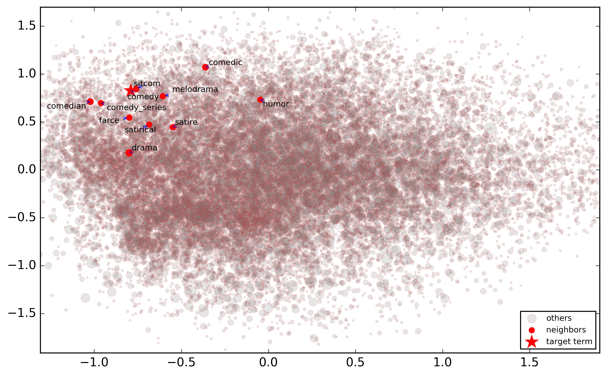
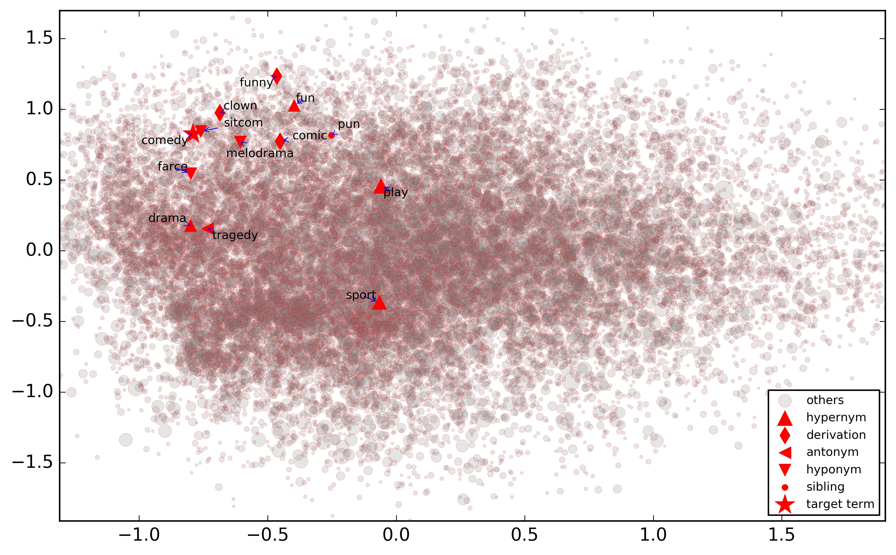
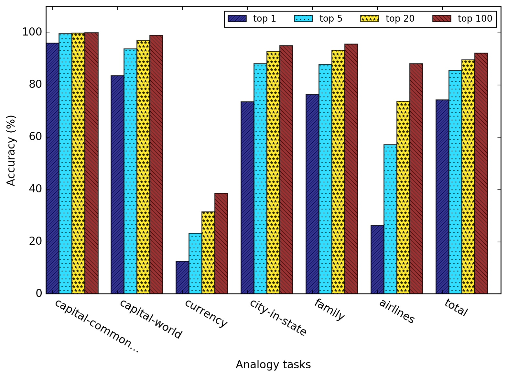
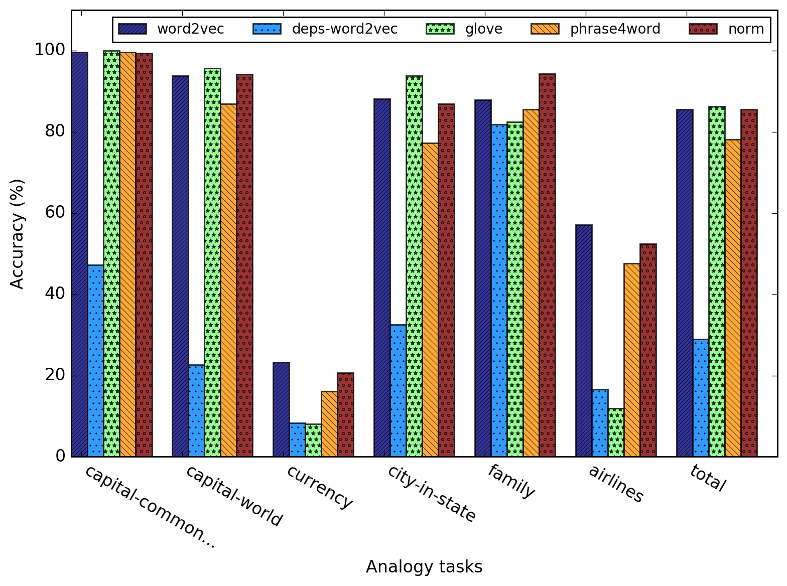
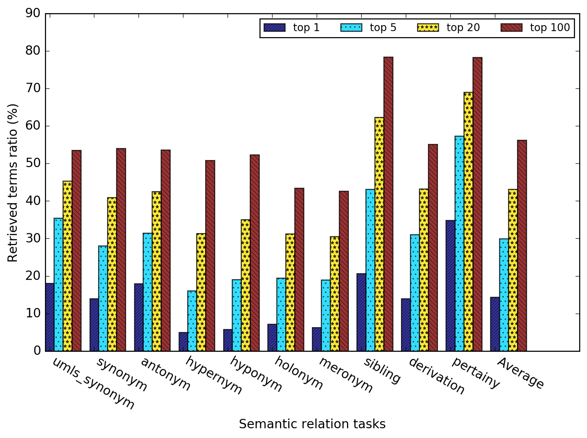
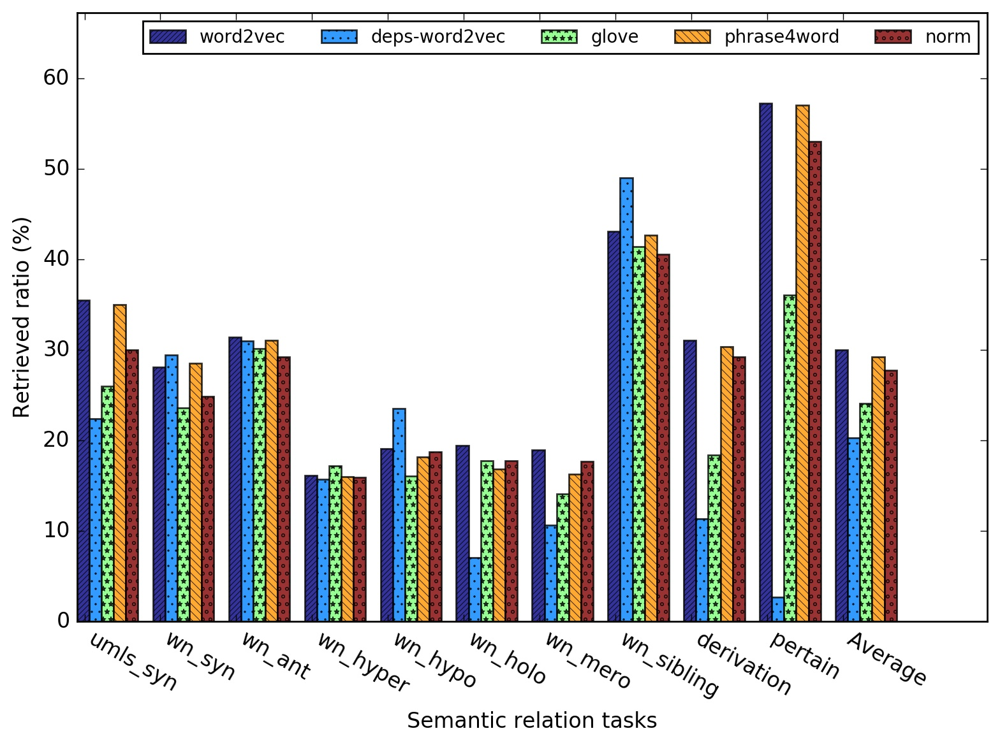
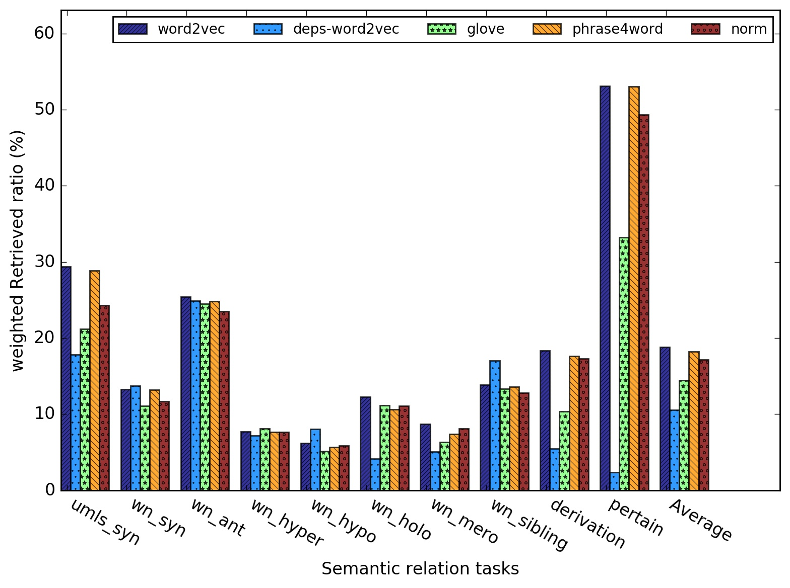
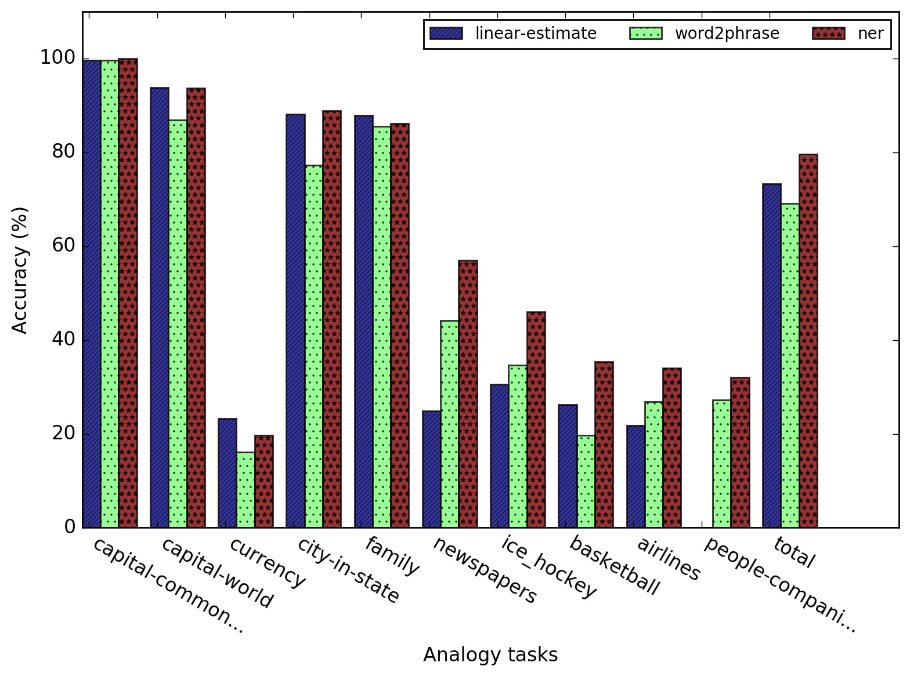
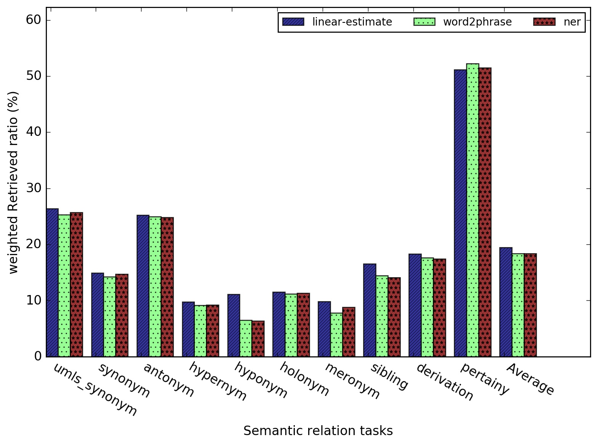

# Wordembedding-and-semantics
## Abstract
Neural network based word embedding has demonstrated outstanding results in variety task, and become a standard input
for NLP related deep learning research. These representations are capable to catch semantic regularities in language,
e.g. analogy relation. While a general question "what kind of semantic relation does the embedding represent and how
 the semantic relation could be retrieved using the embedding model?" is not clear and rare relevant work was explored.
 In this study, we proposed a new approach to explore the semantic relation represented in neural-embedding based
 on WordNet and UMLS. Our study demonstrated neural embedding did prefer some semantic relation as well as the neural
 embedding also represented diverse semantic relations. Our study also found out the NER based phrase composition
 outperformed Word2phrase and the word variants did not affect the performance on analogy and semantic relation tasks.

 ## Method
 [Presentation Link](https://docs.google.com/presentation/d/1eyqICs6EJ0JALZkUqGJh5h2r3jt4aptCueWyutFYd98/edit?usp=sharing)

 ## Result

### Top 10 nearest neighbors

### Evaluation term and its relation term

### Analogy tasks @ Word2vec

### Analogy task @ top 5

### Semantic relation task @ Word2vec

### Semantic relation @ top 5

### Semantic weighted relation @ top5

### Analogy phrase composition

### Semantic relation phrase composition

