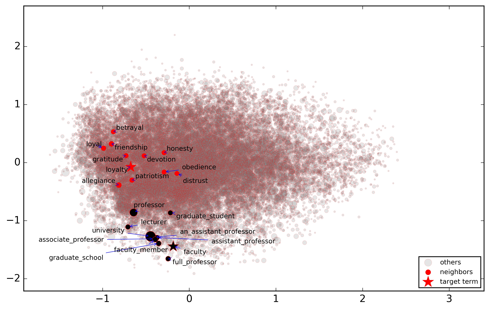

# Wordembedding-and-semantics
## Abstract
In the past few years, neural-network-based word embeddings have been widely used in text mining. However, the vector
representations of word embeddings mostly act as a black box in downstream applications using them, thereby limiting
their interpretability. Even though word embeddings are able to capture semantic regularities in free text documents,
it is not clear how different kinds of semantic relations are represented by word embeddings and how semantically-related
terms can be retrieved from word embeddings.
### Methods
To improve the transparency of word embeddings and the interpretability of the applications using them, in this study,
we propose a novel approach for evaluating the semantic relations in word embeddings using external knowledge bases:
Wikipedia, WordNet and \acrfull{umls}. We trained multiple word embeddings using health-related articles in Wikipedia
and then evaluated their performance in the analogy and semantic relation term retrieval tasks. We also assessed if the
evaluation results depend on the domain of the textual corpora by comparing the embeddings of health-related Wikipedia
articles with those of general Wikipedia articles.
### Results
Regarding the retrieval of semantic relations, we found that word embeddings are able to retrieve diverse semantic
relations in the nearest neighbors of a given word. Meanwhile, the two popular word embedding approaches, Word2vec
and GloVe, obtained comparable results on both the analogy retrieval task and the semantic relation retrieval task,
while dependency-based word embeddings had much worse performance in both tasks. We also found that the word embeddings
trained with health-related Wikipedia articles obtained better performance in the health-related relation retrieval tasks
than those trained with general Wikipedia articles.
### Conclusion
It is evident from this study that word embeddings can group terms with diverse semantic relations together. It is thus
recommended to use domain-specific corpus to train word embeddings for domain-specific text mining tasks.

## Figures

### Figure 1 gives concrete examples of these semantic relations

### Figure 2 shows the words faculty and loyalty and their top 10 nearest neighbors in the reduced word embedding space by Principal Component Analysis (PCA)

### In Figure 3, the same type of relation terms are labeled with the same symbol

### Figures 4 and 5 show the evaluation results of different types of word embeddings in the general and medical-related analogy term retrieval subtasks

### Figure 6 shows the detailed analogy task results when k = 5 for different embedding training methods

### Figure 7 and 8 investigated the retrieved ratio for top 1, 5, 20 and 100 nearest neighbors for each of the three kinds of word embeddings

### Figures 9 and 10 give a closer comparison among the methods when k=5

### Figure 11 shows that health related corpus and general corpus had the similar results in the analogy term retrieval task

### Figure 12 shows that health related corpus obtained slightly better result on general semantic relation retrieval task

Related data: [Google Drive sharing link](https://drive.google.com/open?id=0Bze8dEz4G92GOFRsYlZJdHNHRDA)
